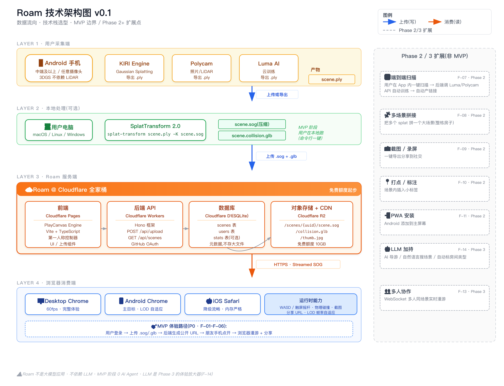

# Roam 技术架构 v0.1

> 起草日期:2026-05-12
> 关联:[01-需求说明.md § 5 技术选型](01-需求说明.md) 是定位描述,本文是结构与流转图。

---

## 一、架构总览图



> SVG 源文件:[diagrams/技术架构图.svg](diagrams/技术架构图.svg)

## 二、4 层结构说明

### Layer 1 · 用户采集端

- **设备**:Android 手机(中端及以上),3DGS 不依赖 LiDAR
- **App**:KIRI Engine / Polycam / Luma AI 任选,都能导出 `.ply`
- **产物**:`scene.ply` — 原始 3D Gaussian Splatting 文件

### Layer 2 · 本地处理(可选,MVP 阶段)

- **机器**:用户自己的电脑(macOS / Linux / Windows)
- **工具**:SplatTransform 2.0 命令行
- **关键命令**:
  ```bash
  splat-transform scene.ply -K scene.sog
  ```
  一次产出**压缩 splat + 碰撞网格**两份产物
- **产物**:
  - `scene.sog`(压缩 splat,流式加载用)
  - `scene.collision.glb`(物理碰撞网格)

> MVP 阶段让用户在本地跑,**后端不做训练流水线**,降低复杂度。Phase 2 会做云端一键产线(F-07)。

### Layer 3 · Roam 服务端(Cloudflare 全家桶)

| 组件 | 用什么 | 职责 |
|---|---|---|
| **前端** | Cloudflare Pages | PlayCanvas Engine + Vite + TypeScript + 第一人称控制器 + 上传/列表 UI |
| **后端 API** | Cloudflare Workers + Hono | `POST /api/upload` · `GET /api/scenes` · GitHub OAuth |
| **数据库** | Cloudflare D1(SQLite) | `scenes` / `users` / `stats` 元数据表(**不存大文件**) |
| **对象存储 + CDN** | Cloudflare R2(免费 10GB) | `/scenes/{uuid}/{scene.sog, collision.glb, thumb.jpg}` |

> 全家桶起步零成本,跨 region 自带 CDN,**避免起步阶段就要选 region / 优化网络**。

### Layer 4 · 浏览器消费端

| 客户端 | 体验目标 |
|---|---|
| Desktop Chrome | 60fps,完整体验 |
| Android Chrome | **主目标**,LOD 自适应,千元机 ≥ 24fps |
| iOS Safari | 内存严格降级,iPhone 11 起步可用 |

**运行时能力**:WASD / 触屏摇杆 + 物理碰撞 + 截图 + 分享 URL + LOD 帧率自适应。

## 三、数据流转(MVP 体验路径)

```
用户登录(GitHub OAuth)
    ↓
本地: scene.ply  →  splat-transform  →  scene.sog + collision.glb
    ↓
上传到 Roam(POST /api/upload)
    ↓
后端: 元数据写入 D1 · 文件写入 R2 · 生成 thumb · 返回公开 URL
    ↓
分享 URL 给朋友
    ↓
朋友手机点开 → Pages 加载 PlayCanvas 应用 → R2 流式拉 .sog → 浏览器漫游
```

## 四、MVP 边界(P0)

| 项 | 边界 |
|---|---|
| ✅ 在 MVP | 上传 / 列表 / 浏览器漫游 / 物理碰撞 / 分享 URL / 移动端适配(F-01~F-06) |
| ❌ 不在 MVP | 云训练 / 多场景拼接 / 截图录屏 / 打点标注 / PWA / 多人协作 / LLM(都列入 Phase 2/3) |

## 五、关键技术选型理由

| 选型 | 理由(不选什么及理由见 01-需求说明.md § 5.3) |
|---|---|
| PlayCanvas Engine | 移动端优化好,完整引擎(灯光 / 相机 / 物理),MIT 开源 |
| SplatTransform 2.0 | PlayCanvas 配套,一行命令产出 splat + 碰撞,无可替代 |
| Cloudflare 全家桶 | 起步全免费,无 region 烦恼,R2 + Pages + Workers + D1 互通 |
| Vite + TypeScript | 个人项目最快上线 |
| **不上 LLM** | MVP 核心功能不需要;Phase 3 才考虑做 AI 导游 / 自然语言搜 |

## 六、性能关键点

| 关注点 | 当前方案 |
|---|---|
| 单场景文件大小 | ≤ 30MB(R2 + Streamed SOG 流式加载) |
| 冷启动 | Cloudflare Pages 边缘缓存 + R2 同区域读取 |
| 移动端帧率 | PlayCanvas LOD + 动态分辨率 + 自适应帧率 |
| 千元机适配 | 帧率检测 → 降级 splat 密度 / 关闭实时光照 |

## 七、安全 / 隐私

- 上传文件类型白名单:仅 `.ply / .sog / .glb / .jpg`
- 单用户上传频率限制(Cloudflare Workers KV 计数)
- 公开 URL 默认开放,提供"非公开链接"(带 token 的签名 URL,R2 原生支持)
- **不做** 人脸识别 / 精确地理位置关联
- 上传时清晰提示用户:"请确保扫描的空间和物品归你所有或已获授权"

## 八、参考资料

- 技术栈知识库:`~/Documents/dev/aidoc/03-Resources/3d-web/playcanvas-3dgs/`
- PlayCanvas FPS 实战博客:<https://blog.playcanvas.com/turning-a-gaussian-splat-into-a-videogame>
- SplatTransform 2.0:<https://github.com/playcanvas/splat-transform>
- Cloudflare Pages:<https://pages.cloudflare.com>
- Cloudflare R2:<https://developers.cloudflare.com/r2/>
- Cloudflare D1:<https://developers.cloudflare.com/d1/>
- Hono 框架:<https://hono.dev>

## 九、修订记录

| 版本 | 日期 | 修订内容 |
|---|---|---|
| v0.1 | 2026-05-12 | 初版架构图 + 4 层结构 + MVP 体验路径 |
