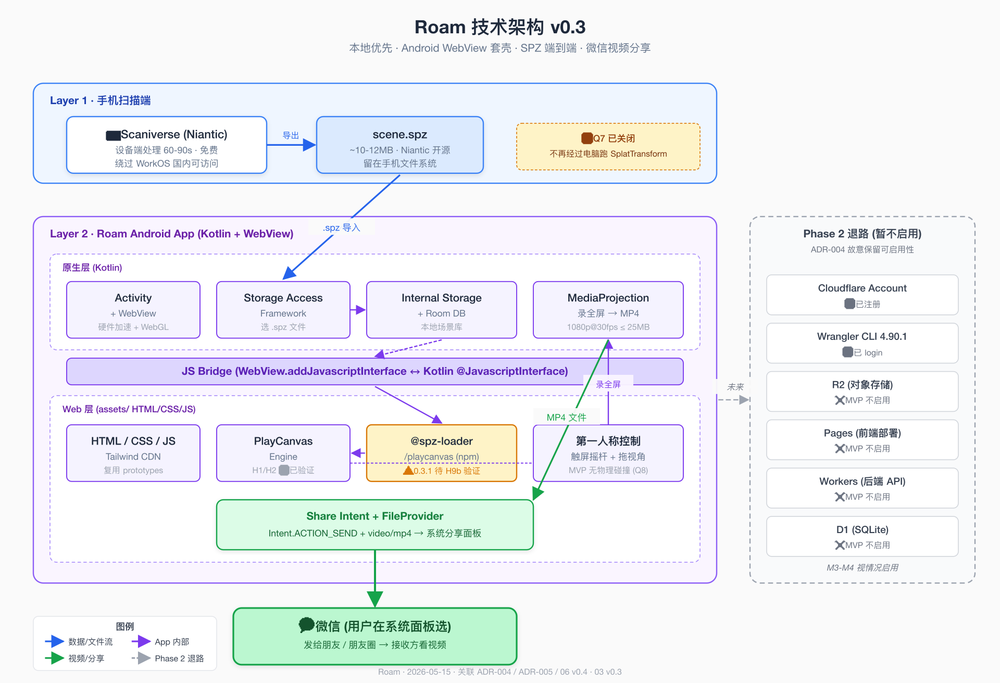

# Roam 技术架构 v0.3

> 起草日期:2026-05-12 · 最新修订 2026-05-15
> 关联:[01-需求说明.md](01-需求说明.md)、[ADR-004 方向调整](decisions/ADR-004-MVP-方向调整-本地优先.md)、[ADR-005 应用形态](decisions/ADR-005-应用形态-Android-WebView套壳.md)、[06-技术可行性验证.md](06-技术可行性验证.md)
> 状态:**v0.3 关闭 Q7**(Layer 2 SplatTransform 体验断点),改用 SPZ 端到端

---

## 一、架构总览图



> SVG 源文件:[diagrams/技术架构图-v0.3.svg](diagrams/技术架构图-v0.3.svg)
> 旧版 v0.1 的 `diagrams/技术架构图.svg/png` 仍保留作为 ADR-004 转向前的历史快照,可对比看演进。

新架构文字版总览(v0.3 已简化为 2 层):

```
[Layer 1 · 手机扫描端]                  [Layer 2 · Roam Android App]
  Scaniverse 扫房间               ─→   WebView + PlayCanvas + JS Bridge
  导出 .spz(Niantic 格式,11.8MB)      ├ 本地场景库(internal storage)
                                       ├ @spz-loader/playcanvas 加载 .spz
                                       ├ 漫游(PlayCanvas Engine)
                                       ├ MediaProjection 录屏
                                       └ Share Intent → 系统分享面板 → 微信

[Phase 2 退路 · Cloudflare 全家桶]
  R2 + Pages + Workers + D1(暂不启用,Wrangler / login 已就绪保留)
```

**v0.3 关键简化**:Scaniverse 原生导出 SPZ 格式 + PlayCanvas 通过 `@spz-loader/playcanvas` 直接 runtime 加载 SPZ,**全程在手机闭环,不再经过电脑跑 SplatTransform**。

---

## 二、2 层结构说明(v0.3 进一步简化)

### Layer 1 · 手机扫描端

- **设备**:Magic7 Pro(zhi 主力机)+ 同类近 2 年 Android 旗舰
- **App**:**Scaniverse**(Niantic,免费,设备端处理,绕过 WorkOS,已装到 Magic7 Pro)
- **导出格式**:**`.spz`**(Niantic 开源,MIT,~10x 压缩比;500K splats 场景 PLY 118MB → SPZ 11.8MB)
- **传输**:扫描完毕 → SPZ 文件留在手机文件系统 → Roam Android App 用 Storage Access Framework 选择导入(同手机内复制,**0 跨设备传输**)
- **备选**:KIRI Engine Pro($17.99/月,如果 Scaniverse 实际质量不满意)

### ~~Layer 2 · 本地压缩~~ → 已删除(v0.3)

v0.2 标的体验断点 Q7(SplatTransform 卡在电脑)在 v0.3 通过**改用 SPZ 格式**关闭:

- Scaniverse 直出 SPZ,SPZ 已经够小(< 12MB / 典型场景 ≤ 30MB)
- PlayCanvas 通过 `@spz-loader/playcanvas` runtime 直接加载 SPZ,无需 SOG 转换
- **整套流程主理人不需要离开手机**,完全闭环

**保留方案**:如果 M1 实测 SPZ 在 PlayCanvas 上有问题(渲染异常 / 性能差),回退到「Scaniverse 导出 PLY → 电脑跑 SplatTransform 转 SOG → 传回手机」(v0.2 的方案)。

### Layer 2 · Roam Android App(MVP 核心)

WebView 套壳形态,详见 [ADR-005](decisions/ADR-005-应用形态-Android-WebView套壳.md)。

| 模块 | 实现 |
|---|---|
| **应用主体** | Android Activity + WebView(Kotlin) |
| **前端** | HTML / CSS / JS 放 `assets/`,WebView 加载本地路径;Tailwind CDN(M1 可换 Vite + 框架) |
| **3D 引擎** | PlayCanvas Engine,跑在 WebView 内(H2 验证 Magic7 Pro Chrome 流畅,H9 待验证 WebView 同等性能) |
| **3DGS 加载** | **`@spz-loader/playcanvas`**(npm 0.3.1)— `createGSplatEntityFromSpzUrlAsync(url)` 加载本地 SPZ;**M1 第 0 周需要先验证它在 Android WebView 里跑得通**(社区包,非 PlayCanvas 官方) |
| **第一人称控制** | PlayCanvas 内置控制器 + 自定义触屏 / 虚拟摇杆 |
| **JS Bridge** | `WebView.addJavascriptInterface()` + Kotlin `@JavascriptInterface`,暴露原生能力给前端 |
| **本地存储** | Android internal storage(`/data/data/com.roam.app/files/`)存 .spz;Room DB 或 SharedPreferences 存场景元数据 |
| **文件导入** | Storage Access Framework(`ACTION_OPEN_DOCUMENT`)选 .spz → 复制到 internal storage |
| **视频录制** | MediaProjection API 录全屏(含 WebView 渲染 + UI)→ MP4 |
| **分享** | `Intent.ACTION_SEND` + FileProvider 视频 URI → 系统分享面板 → 用户选「微信」 |
| **分发** | **自签名 APK**,zhi `adb install` 装到 Magic7 Pro。**MVP 不上应用商店** |

### Phase 2 退路 · Cloudflare 全家桶(暂不启用)

ADR-004 决策时**故意保留**这一层的可用性:

| 组件 | 状态 |
|---|---|
| Cloudflare 账号 | ✅ 已注册 |
| Wrangler CLI 4.90.1 | ✅ 已装并 login |
| R2 / Pages / Workers / D1 | ❌ MVP 不启用 |

**何时启用**:M3-M4 阶段如果发现「视频微信分享的传播链太短」,启用 R2 + Pages 做公网漫游。这时新增 Layer 3 浏览器消费端 + Layer 4 Cloudflare 服务端。

---

## 三、数据流转(MVP 路径,本地闭环 v0.3)

```
[手机 Scaniverse]
  扫房间 → 设备端处理 60-90s → 导出 scene.spz(~10MB)

[手机 Roam App]
  Storage Access Framework 选 scene.spz
    ↓
  复制到 internal storage
    ↓
  在场景库列表显示(Room DB 元数据)
    ↓
  点开 → WebView 加载 → @spz-loader/playcanvas 加载 SPZ → PlayCanvas 渲染 → 漫游
    ↓
  点录制按钮 → MediaProjection 启动 → 录 60s → MP4 落 internal storage
    ↓
  点分享按钮 → Share Intent + FileProvider → 系统分享面板 → 微信 → 发给朋友

[接收方]
  微信对话 → 看视频 → (可选 Q4 二维码回路,M2 决定)
```

---

## 四、MVP 边界(v0.3 更新)

| 项 | 边界 |
|---|---|
| ✅ 在 MVP | 本地导入 .spz / 本地漫游 / 录屏 / Share Intent 分享 / 场景库管理 |
| ❌ 不在 MVP | Cloudflare 全家桶 / 公开 URL / 多人浏览 / 云训练 / iOS / 接收方回路 / LLM |
| ⏳ M1 待决 | Q5 视频规格 / Q6 项目结构(Q7 v0.3 已关闭) |
| ⏳ M2 待决 | Q3 改名 / Q4 接收方回路 |

---

## 五、关键技术选型理由(v0.3)

| 选型 | 理由 |
|---|---|
| **Android WebView 套壳** | ADR-005 比较 4 个形态选定。复用 prototypes 前端,工程量 ~600 行 Kotlin |
| **PlayCanvas Engine** | 移动端优化好,MIT 开源;H1/H2 已验证流畅;WebGL 渲染兼容 WebView |
| **`@spz-loader/playcanvas`** | runtime 直接加载 SPZ,免去 SplatTransform 转换步骤;**风险:社区包 0.3.1 偏早期,需 H9 验证** |
| **Scaniverse + SPZ 格式** | 免费 + 设备端 + 国内可访问 + 原生导出 SPZ;**SPZ ≈ SOG 压缩比但开源标准化**,Niantic MIT 开源,Khronos KHR_gaussian_splatting glTF extension 2026 年标准化在即 |
| ~~SplatTransform 2.0~~ | **v0.3 移出 MVP 主路径**;保留为 H9 失败的回退方案(把 SPZ→SOG 或 PLY→SOG) |
| **MediaProjection 录全屏** | 包含 PlayCanvas 渲染 + UI 操作,接收方看的视频更完整 |
| **Share Intent 分享** | 不需要微信 OpenSDK 企业认证;对比 PWA 的 Web Share API 几乎一样体验 |
| **Kotlin + Android Studio** | 原生 Android 最稳;不需要跨端开销 |
| **不上 Cloudflare** | ADR-004 转向本地;保留 Wrangler 配置作 Phase 2 退路 |
| **不上 LLM** | 不变,见 [04 § 1.3](04-上下文交接.md) |

---

## 六、性能关键点(v0.3)

| 关注点 | 当前方案 |
|---|---|
| 单场景文件大小 | SPZ < 30 MB(典型 10-12MB,大场景上限 30MB) |
| 启动速度 | APK 本地,无网络冷启动;WebView 加载本地 HTML,~1 秒可漫游 |
| WebView 渲染 | H9 待验证 — WebView 是否真等同 Chrome;预期 Magic7 Pro WebView ≥ 60fps |
| **SPZ 加载耗时** | H9 子项 — `@spz-loader` 解 SPZ 文件 → 上传 GPU,预期 < 2s(社区包性能未实测) |
| 视频录制不掉帧 | H7 待验证 — 1080p@30fps 录 60s,录制中 PlayCanvas 仍 ≥ 30fps |
| 视频文件大小 | 60s 1080p H.264 ≤ 25MB(微信限制);H7 验证码率控制 |
| 内存 | 30MB SPZ 解压后约 100-200MB 显存;Magic7 Pro 12GB+ RAM 完全不愁 |

---

## 七、安全 / 隐私(v0.3,保持 v0.2 大幅简化的版本)

ADR-004 转向本地后,**几乎所有原 v0.1 隐私顾虑消失**:

- ✅ **无服务器存储**:扫描数据全在用户手机,不上传任何云
- ✅ **无身份系统**:没有登录,不需要 OAuth,不收集用户信息
- ✅ **无网络遥测**:MVP 不收 analytics
- ✅ **微信分享是用户主动**:Share Intent 由用户点按钮触发
- ⚠️ **MediaProjection 权限提示**:Android 每次录屏弹系统级保护对话框,无法绕过

唯一新隐私点:扫描数据存本地,如果手机丢失 / 被借走有泄露风险。MVP 不加密(过度工程),M2 再评估。

---

## 八、参考资料

- PlayCanvas Engine:<https://github.com/playcanvas/engine>
- PlayCanvas FPS Demo:<https://playcanv.as/p/qxGSuzYq/>(H1/H2 已验证)
- **`@spz-loader/playcanvas`**:<https://www.npmjs.com/package/@spz-loader/playcanvas>(MVP 关键依赖)
- **Niantic SPZ 格式**:<https://github.com/nianticlabs/spz>(MIT 开源)
- Scaniverse SPZ 公告:<https://scaniverse.com/news/spz-gaussian-splat-open-source-file-format>
- SplatTransform(回退方案):<https://github.com/playcanvas/splat-transform>
- Scaniverse(Niantic):<https://scaniverse.com>
- Android WebView 文档:<https://developer.android.com/develop/ui/views/layout/webapps/webview>
- MediaProjection API:<https://developer.android.com/reference/android/media/projection/MediaProjectionManager>
- Storage Access Framework:<https://developer.android.com/guide/topics/providers/document-provider>
- 技术栈知识库:`~/Documents/dev/aidoc/03-Resources/3d-web/playcanvas-3dgs/`

---

## 九、修订记录

| 版本 | 日期 | 修订内容 |
|---|---|---|
| v0.1 | 2026-05-12 | 初版 4 层结构(采集 / 本地处理 / Cloudflare / 浏览器),Web SaaS 方向 |
| v0.2 | 2026-05-14 | 根据 ADR-004/005 重大转向重写:删除 Cloudflare 全家桶层 + 浏览器消费端层;新增 Roam Android App 层(WebView 套壳);标注 Layer 2 体验断点 Q7;隐私章节大幅简化 |
| v0.3 | 2026-05-15 | **关闭 Q7**:改用 Scaniverse 直出 SPZ + `@spz-loader/playcanvas` runtime 加载,删除 Layer 2 SplatTransform 步骤;架构进一步简化为 2 层;SplatTransform 降为 H9 失败回退方案;新增 SPZ 加载耗时性能关注点 |
| v0.3.1 | 2026-05-15 | 重画架构图 `diagrams/技术架构图-v0.3.svg/png`(用 fireworks-tech-graph),与 v0.3 文字内容对齐;旧 v0.1 图保留作历史 |
